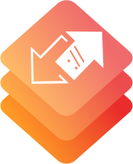

# CallbackURLKit - Inter app communication

[](http://mit-license.org)
[](https://developer.apple.com/resources/)
[](https://developer.apple.com/swift)
[](https://github.com/phimage/CallbackURLKit/issues)
[](http://cocoadocs.org/docsets/CallbackURLKit/)
[](https://gitter.im/phimage/CallbackURLKit?utm_source=badge&utm_medium=badge&utm_campaign=pr-badge&utm_content=badge)

[](#logo) Starting to integrate URL scheme in an app,
why not be compliant with [x-callback-url](http://x-callback-url.com/specifications/).
```swift
CallbackURLKit.register(action: "play") { parameters, ... in
  self.player.play()
}
```
Want to interact with one of the numerous other applications which implement already [x-callback-url](http://x-callback-url.com/apps/), you can also use this framework.

```swift
CallbackURLKit.perform(action: "open", urlScheme: "googlechrome-x-callback",
                             parameters: ["url": "http://www.google.com"])
```

## Usage

### Perform action on other applications
Anywhere in your code after imported CallbackURLKit you can call
```swift
try CallbackURLKit.perform(action: "actionName", urlScheme: "applicationName",
    parameters: ["key1": "value1"])
```
You can also use a new `Manager` or the shared instance
```swift
try Manager.shared.perform(action: "actionName", urlScheme: "application-name",
    parameters: ["key1": "value1"])
```

#### Declare targeted applications URL schemes in iOS9
In iOS 9 you must whitelist any URL schemes your app wants to query in Info.plist under the *LSApplicationQueriesSchemes* key (an array of strings)


#### Create a client class
Alternatively you can create a new `Client` object where you can define the targeted app URL scheme.
```swift
let client = Client(urlScheme: "application-url-scheme")
try client.perform(action:(..)
```
or create a new `Client` class to add some utility methods which hide implementation details and allow to make some parameters check.
```swift
class GoogleChrome: Client {
  init() {
    super.init(urlScheme:"googlechrome-x-callback")
  }
  func open(url: String, ...) {
    self.perform(action: "open", parameters: ["url": url], ...)
  }
}
```
see full sample into [Clients](/Clients) directory. *(You can PR to add new `Client` classes)*

You can check that an application respond to the URL scheme using `client.appInstalled`

#### Use callback closure
Callbacks allow you to receives informations or status from the targeted applications but before you need to [add x-callback-url support to your app](#add-x-callback-url-support-to-your-app).

Then you can specify one of the 3 x-callbacks: success, failure and cancel

```swift
try client.performn(action: "actionName",
    onSuccess: { parameters in
    },

onFailure: { error in
    },
    onCancel: {
    }
)
```

### Add x-callback-url support to your app ###

#### Register your URL scheme
Apps can declare any custom URL schemes they support. Use the URL Types section of the Info tab to specify the custom URL schemes that your app handles.


Or register your URL Scheme directly into Info.plist file:
- Add URL Types, then within Item 0
- Set Document Role to Editor.
- URL Identifier to your app bundle ID.
- Create a URL Schemes field and set Item 0 to the URL Scheme you want to use.

Apple documentation: [Using URL Schemes to Communicate with Apps](https://developer.apple.com/library/ios/documentation/iPhone/Conceptual/iPhoneOSProgrammingGuide/Inter-AppCommunication/Inter-AppCommunication.html#//apple_ref/doc/uid/TP40007072-CH6-SW1).

#### Setup framework with URL scheme
Then you must set the scheme to this framework manager
 ```swift
 let manager =  Manager.shared
 manager.callbackURLScheme = "my-application-scheme"
 // or get the first from Info.plist using utility method
 manager.callbackURLScheme = Manager.urlSchemes?.first
 ```
#### Handle incoming URLs
And finally to handle incoming URLs, your application delegate should implement the following methods below.

On iOS
```swift
func application(_ application: UIApplication, open url: NSURL, sourceApplication: String?, annotation: Any) -> Bool {
    manager.handleOpen(url: url)
    return true
}

@available(iOS 9.0, *)
func application(_ app: UIApplication, open url: URL, options: [UIApplicationOpenURLOptionsKey : Any] = [:]) -> Bool {
    manager.handleOpen(url: url)
    return true
}
```

On OSX if you have no other need with URL events you can let manager do all the job by calling into `applicationDidFinishLaunching`
the method `Manager.instance.registerToURLEvent()`

#### Add new action
The client application will interact with your application using the following URL Structure.

`[url-scheme]://x-callback-url/[action]?[x-callback parameters]&[action parameters]`

An action is defined by its name (the url path), and optional action `parameters`.

```swift
manager["myActionName"] = { parameters, success, failure, cancel in
  // action code, using or not the parameters
  ...
  // notify the client app with one of the callback
  success(nil) // or failure(exception)
}
```
You can also register an action on shared `Manager` instance using
```swift
CallbackURLKit.register(action: "myActionName") { parameters, success, failure, cancel in

}
```

## Installation

## Using CocoaPods ##
[CocoaPods](https://cocoapods.org/) is a centralized dependency manager for
Objective-C and Swift. Go [here](https://guides.cocoapods.org/using/index.html)
to learn more.

1. Add the project to your [Podfile](https://guides.cocoapods.org/using/the-podfile.html).

    ```ruby
    use_frameworks!

    pod 'CallbackURLKit'
    ```

2. Run `pod install` and open the `.xcworkspace` file to launch Xcode.

### Clients
To get an already implemented [Clients](/Clients) use one of the subspec
```ruby
pod 'CallbackURLKit/GoogleChrome'
```

## Links
- [http://x-callback-url.com/](http://x-callback-url.com/)
- [https://onetapless.com/library](https://onetapless.com/library)
- [http://handleopenurl.com/](http://handleopenurl.com/)
